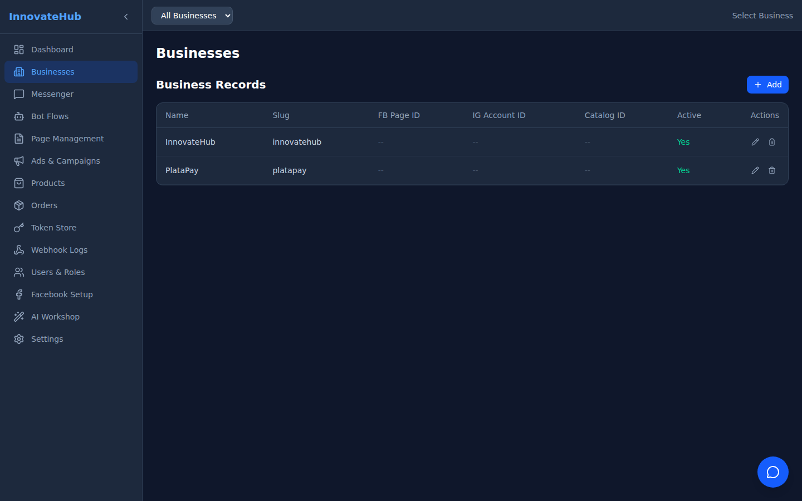

# Business Management

Manage your connected Facebook Business accounts from a centralized interface.

## Features

- **View all businesses** — See all registered business accounts with their Facebook Page IDs
- **Add new business** — Register a new Facebook Business account
- **Edit business details** — Update business name, page ID, and configuration
- **Delete business** — Remove a business and its associated data

## Business Fields

| Field | Description |
|-------|-------------|
| Name | Business display name |
| Facebook Page ID | Connected Facebook Page identifier |
| Access Token | Facebook API access token (masked) |
| Status | Active / Inactive |
| Created | Registration date |
