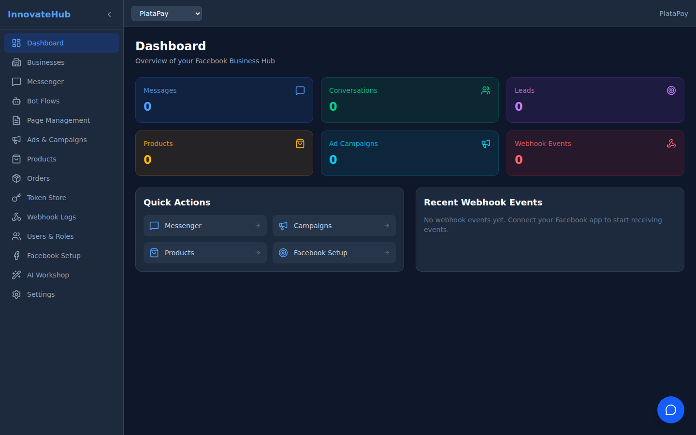

# Dashboard Home

The Dashboard home page provides an at-a-glance overview of your Facebook Business Hub with real-time statistics and quick actions.

## Stat Cards

Six key metrics are displayed as color-coded cards:

| Metric | Color | Description |
|--------|-------|-------------|
| Messages | Blue | Total Facebook Messenger messages received |
| Conversations | Green | Active conversation threads |
| Leads | Purple | Facebook Lead form submissions |
| Products | Yellow | Items in your product catalog |
| Ad Campaigns | Cyan | Active advertising campaigns |
| Webhook Events | Red | Recent webhook events processed |

Each card shows a loading skeleton while data is being fetched from Back4App.

## Quick Actions

Four shortcut buttons for the most common tasks:

- **Messenger** — Jump to conversation management
- **Campaigns** — Create or manage ad campaigns
- **Products** — Add or edit product listings
- **Facebook Setup** — Configure Facebook integration

## Recent Webhook Events

A live feed of the 5 most recent webhook events, showing:
- Event type (message, postback, referral, etc.)
- Timestamp
- Processing status (processed/pending)

## Business Selector

Use the dropdown in the header to filter all data by a specific business account. Select "All Businesses" to see combined data.
