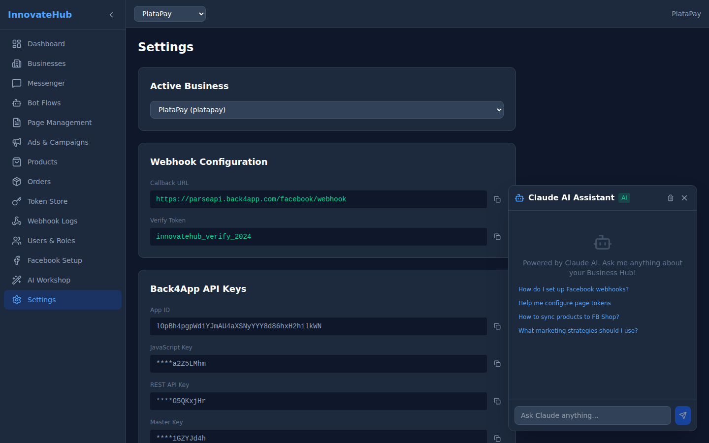

# Settings

Configure global dashboard preferences and application settings.

## Available Settings

- **API Keys** — View and manage Back4App API keys
- **Webhook Configuration** — Set callback URLs and verify tokens
- **AI Proxy** — Configure the AI proxy endpoint URL
- **Notifications** — Enable/disable event notifications
- **Display** — Theme and layout preferences
