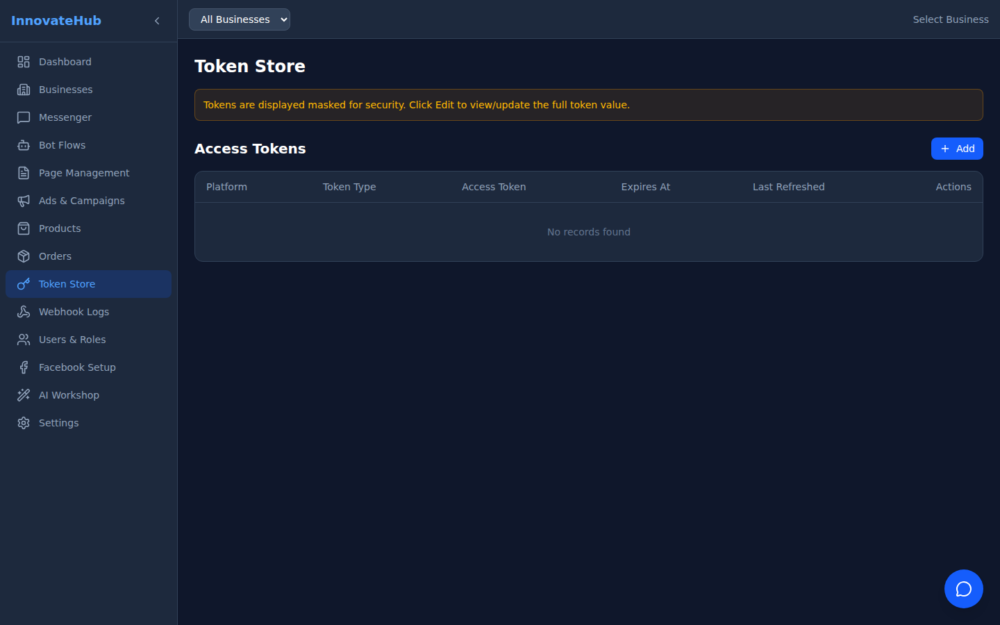
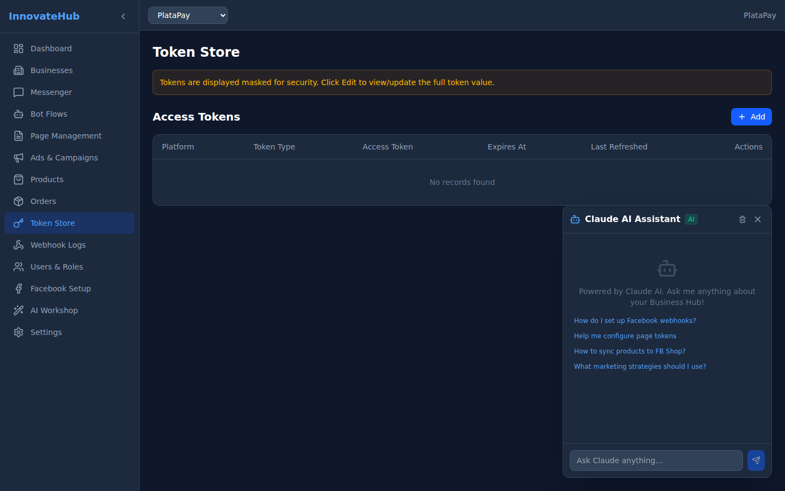

# Token Store

Securely manage Facebook API access tokens for your business accounts.

## Features

- **View tokens** — See all stored access tokens with expiry dates
- **Refresh tokens** — Manually or automatically refresh expiring tokens
- **Token status** — Monitor token health (valid, expiring, expired)
- **Secure storage** — Tokens are stored encrypted in Back4App

## Token Types

| Type | Lifetime | Description |
|------|----------|-------------|
| Page Access Token | Long-lived | Used for page API operations |
| User Access Token | Short-lived | Used for user-level operations |
| App Access Token | Never expires | Used for app-level operations |

## Auto-Refresh

A background Cloud Job runs daily to refresh tokens nearing expiration, ensuring uninterrupted API access.
