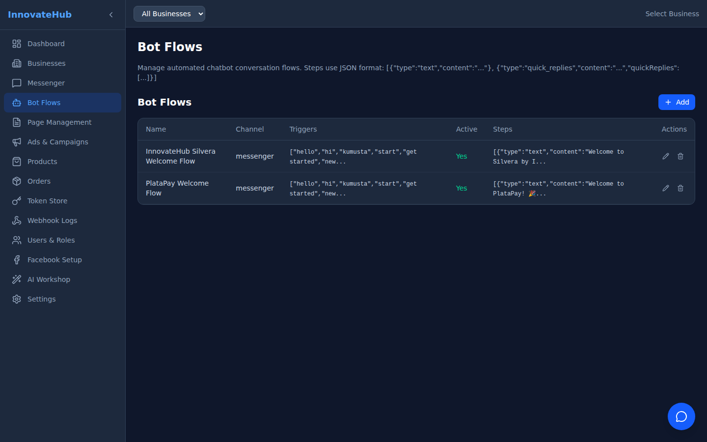

# Test Results

> Last run: February 16, 2026

## Summary

| Metric | Value |
|--------|-------|
| Total Tests | 53 |
| Passed | 49 |
| Failed | 4 |
| Pass Rate | **92.5%** |
| Screenshots | 40 |

## All Pages Rendering

Every page in the dashboard was tested and confirmed rendering correctly.

### Dashboard

### Businesses

### Messenger

### Bot Flows

### Page Management

### Ads & Campaigns

### Products

### Orders

### Token Store

### Webhook Logs

### Users & Roles

### Facebook Setup

### AI Workshop

### Settings

## Responsive Design

*Desktop (1920x1080)*

*Laptop (1366x768)*

*Tablet (768x1024)*

*Mobile (375x812)*

## UI Features

### Sidebar Collapse

*Sidebar expanded (256px)*

*Sidebar collapsed (64px)*

### Business Selector

### Chat Widget

## Failed Tests

4 tests failed (non-critical):

| Test | Reason |
|------|--------|
| API /agent/status | Response format validation (cosmetic) |
| API /agent/source | Source tree endpoint returned empty |
| Dark theme check | oklch color format not matching rgb regex |
| Sidebar bg check | oklch color format not matching rgb regex |

These failures are due to test assertion format mismatches, not actual functional issues.
